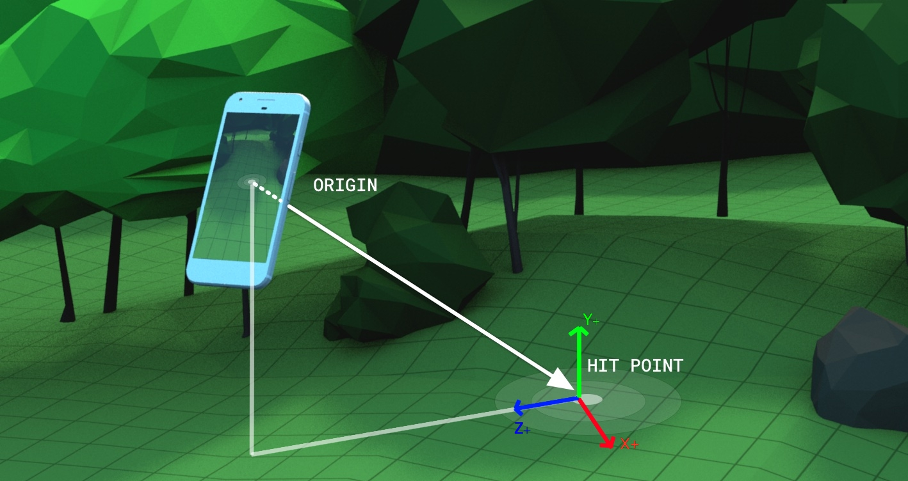

# WebXR - Hit-test Explainer



# Overview

A common AR use-case on the web will involve placing virtual objects in the real world. In order to place an object in a user-picked location that corresponds to real-world geometry, the most common approach is a raycast into the AR system's understanding of the real world. AR systems can have a wide variety of world understanding elements such as planes, point clouds, and meshes, all of which would potentially need to be considered by such a raycast. 

There are two basic options for providing placement of virtual objects in the real world using a raycasting approach:

1.  Expose _all_ the world understanding elements calculated by the underlying AR system to the app and then the app could implement its own raycast against those elements. This approach has the following problems:
    * It requires an extremely complex API - one that could vary from AR system to AR system and user agent to user agent depending on technology - in order to provide all the world understanding data, which could include diverse elements such as planes, point clouds, meshes, etc., to the app.
    * It demands that each developer produce their own raycasting algorithm, which both decreases the consistency of AR experiences and puts a lot of burden on the developer to either write their own logic or to include a third-party raycasting library.
    * The privacy problem of needing to serve "the world" to content rather than answering a question that hit tests solve: "is there real-world geometry along this ray?" The simpler hit-test API should have reduced privacy concerns and lends itself to mitigation strategies, e.g. throttling.

2.  Provide a single API for doing a raycast against world-understanding elements calculated by the underlying AR system. This approach is what this explainer advocates for it has the following advantages:
    * Provides the same basic functionality that apps need to place virtual objects without having to expose the world understanding directly. 
    * Provides consistency / performance advantages over external raycasting algorithms as the underlying AR system can leverage complex data structures such as k-d trees in order to perform fast hit-tests without having to expose those structures or force the developer to recreate them. 
    * Because it abstracts the world understanding of the AR system behind a single API, it means different AR systems with diverse conceptualizations of the real world can be abstracted into a common API.

# Use-cases

Use-cases enabled by such an API include:

*   Show a reticle that appears to track the real world surfaces at which the device or controller is pointed.
    *   Often, AR apps want to show a reticle that appears to stick to real-world surfaces. In order to do this, the app could perform a hit-test every frame, usually based on a ray that emanates from the center of the user's perspective. This would allow the developer to render the reticle appropriately on real-world surfaces as the scene changes. This use-case is made accurate by using the the coordinate system for an XRDevice or XRInputSource as the frameOfReference parameter and a relative ray. 
    *   Frequency: this action is done every single frame.
*   Place a virtual object in the real world
    *   The most common form of real-world geometry is horizontal surfaces on which virtual objects could be placed. In order for those virtual objects to appear to be anchored in the real world, they must be placed at the same height as the real world objects (the floor, a table, …). Usually the placement is in response to a user gesture such as a tap. On tap, the app casts a ray into the world emanating from the touch location and gets a hit result with a pose that represents the location in the real world that ray would intersect and has an representing the normal of the surface that was hit so the object can be placed realistically. A hit-test API would allow the developer to detect geometry in response to a user gesture and use the results to determine where to place/render the virtual object. 
    *   Frequency: this action is usually done sparsely - once every several seconds or even minutes in response to user input.
    *   An app may want to ensure that there is enough room for an object before allowing it to be placed. This kind of test likely requires a more sophisticated API, probably exposing the world understanding elements directly, however in the interim the app could make use of the hit-test API by doing a handful of tests. For example, doing a test at each corner of the object's 2d footprint bounding box and making sure that each has a valid result and are coplanar would be a simple approach to take.
    *   The app might want to present feedback on the reticle as to whether the object could be placed at the current location as the user moves around. In this case, especially combined with the previous point of doing multiple hit-tests to ensure the object fits, the system might be required to be able to handle several hit-tests per frame under a normal load.
    *   An app may want to cast a ray (or a set of them) and directly assume that if the normal vector that comes with the hit results are inside certain range, a horizontal or vertical surface is detected (even more than one sample could be used for more accuracy/certainty) and then show to the user that the whole surface is a plane with infinite surface to place objects on. This is a pretty common practice in the current generation of AR technologies that only detect horizontal or vertical planes.
    *   The more hit-testing that is performed in service of the above use-cases, the more an app could derive the world understanding by mapping it using raycasts. This may create privacy risks and require throttling to mitigate.
*   Tap vs. Controller-driven
    *   Hit-test requests can come from multiple different contexts. For example, an object might want to be placed on a tap using a smartphone. Alternatively, we might want to show a reticle where the controller ray is pointing and then place an object on a controller button event. These are very different timing-wise with respect to the WebXR spec - a controller event happens completely out-of-band from the frame logic, while a tap could be done at the next frame.
    *   There must be support for the case where a hit-test must be done out-of-band from the frame-to-frame business logic.

# Details

A discussion of hit-testing wouldn't be complete without talking about what kinds of things will be hit and how the results will be returned. The following are proposed:

## Inputs

The API should accept as input an origin and direction for the raycast as well as a frame-of-reference to which the ray is relative. The coordinate system for an XRDevice or XRInputSource can be used as the frame-of-reference to enable accurate hit-tests based on relative rays to a device/input-source which gives frame-accurate results based on the device's pose on the frame subsequent to the hit-test resolving.

The initial API may not include an options parameter, a dictionary of options that allows customization of the hit-test. Such a structure would allow the caller to specify things such as which types of world understanding elements should be considered valid (planes, meshes, point-clouds, etc.) We can safely leave this off for now since we can add parameters to the function without disrupting existing calls. In order to clarify this support, the API should throw an error if there are additional parameters included.

## Outputs

The basic return type of the hit-test API will likely be a sorted array of objects containing the hit results. Returning an object makes it easy to extend the functionality of the hit-test API in the future without re-architecting the basic structure of the API for existing apps.

Early API implementations may choose to return only location and orientation information as results. However, it is very likely that apps will, in the future, want to know what object was hit, especially as more sophisticated APIs are introduced that expose the actual world understanding elements - after all, knowing what was hit could be an important aspect of connecting world understanding to the placement of virtual objects. For example, you might not want to allow placement of an object near the edge of a table or if it is a large object, maybe the table surface isn't even large enough for the object at all. 

This explainer does not address Anchors (see [anchors](https://github.com/immersive-web/anchors)), however hit results and anchors are related topics.

## Timing

This API should be asynchronous in order to avoid main thread blocking calls. This also allows more flexibility in the underlying implementation. It is important to note that, due to the asynchronous nature of the API, hit results will always have at least 1 frame of latency.

### Latency

Can we make a guarantee that the promise will resolve prior to the next frame? This may not be possible on all systems, so speed of resolution is left as a quality-of-implementation issue for the UA. Ideally, the system would resolve hit-tests before the next frame as long as they were called within the RAF of that frame. It shouldn't matter whether this call is made before or after calling `xrSession.requestAnimationFrame(...)` within the RAF, as it is common practice to make that call at the beginning of the RAF in case there are exceptions later on in the function.

### Frame Context

Regardless of how long it takes for the hit-test to resolve, it needs to be guaranteed that the result is valid for the subsequent frame. This is critical to provide accurate hit-testing that can be used, for example, by an app to place an object on a surface. If the object is placed in response to the promise resolution and then the RAF for the subsequent frame is called and the object is rendered for the first time, it must be rendered in a location consistent with the state of the world for that frame in order to avoid inaccuracies in placement due to moved or deleted world elements.

If the hit-test is being used to place a continuously-updating object like a reticle that tracks a device or controller, the coordinate system of that object should be used as the frame-of-reference to avoid using an out-of-date ray that is generated from the pose on the current frame when the results come in for a future frame.

If the hit-test is being used in response to a touch/controller event to place an object, an absolute ray should be used along with a global "eye-level" coordinate system since the object should be placed at the location that the user expected at the time of their click, not based on an updated pose for the frame on which the test resolves.

Note: It is important that the hit-test resolves as quickly as possible so that, if the ray was generated based on the pose of the device, the results feel accurate and responsive.

The resolution of the hit-test is also the appropriate time to create an anchor at the point of the hit if an object will be placed there. This means that the anchor will be created connected to the world state of the correct frame - the frame immediately following that resolution - and any updates that happen to the underlying world understanding elements, such as the plane that was hit, will trigger an update to the object's transform. Just like hit-test timing, the anchor updated callback should happen with a new pose that matches the world understanding of the frame immediately following that callback.

For pass-through clients, this timing guarantee may not be technically possible since the view of the world is real-time. Some amount of latency of the hit-test results may be unavoidable unless a prediction model can be implemented.

This sequence illustrates basic timing:
*   request hit-test
*   frame 1..(n-1) (could be any number of frames here)
*   hit-test resolves (for frame n) - place object at hit location
*   frame n - object is rendered in location accurate to the world state at frame n

If we add anchors and the anchors API can't guarantee that anchors can be resolved within one frame, then the best practice to avoid floating or embedded objects would be:
*   request hit-test
*   frame 1..(n-1) (could be any number of frames here)
*   hit-test resolves (for frame n) - request anchor
*   frame n..(m-1) (could be any number of frames here)
*   anchor resolves (for frame m) - place object at anchor location
*   frame m - object is rendered in location appropriate to the world state and its pose will be updated continuously such that its location remains accurate to the world state at each frame

# Privacy and Security

Creating an API that provides information about the real world has privacy implications. Real world geometry data can be used for both fingerprinting and identification of users and location. For example:
*   The geometry of a user's room may be used to fingerprint between sessions and/or across users
*   The user's facial geometry may allow a site to identify the user
*   The geometry of a known location may allow a site to identify the user's location

In many ways these privacy implications are similar to video (camera) inputs and should be considered to have similar privacy implications. However, the implications are not necessarily equivalent. For example, users may consider their image to be more private than the layout of their room while a mesh of one's face may allow easier fingerprinting than RGB image processing.

# API IDL
```
[SecureContext, Exposed=Window] interface XRHitResult {
  readonly attribute Float32Array hitMatrix;
};

partial interface XRSession {
  Promise<FrozenArray<XRHitResult>> requestHitTest(Float32Array origin, Float32Array direction, XRCoordinateSystem coordinateSystem);
}
```

## API Details

`hitTest` parameters
*   origin - the origin of the ray as [x, y, z]
*   direction - the direction of the ray as [x, y, z] - any non-zero-length direction vectors that are passed to the API will automatically be normalized
    *   Note: We'll start with an  origin-direction pair instead of a pose as a pose overspecifies a ray and has the danger of the developer creating a malformed matrix
*   coordinateSystem - the coordinate system the ray origin/direction and hit results should be relative to. In order to get a pixel-perfect hit-test relative to an XRDevice or XRInputSource, the coordinate system for that device/input-source should be used here (along with a ray relative to that). This will let the underlying algorithm update the coordinate system for the frame on which the hit-test will be calculated so that the results are valid for the pose on the subsequent frame instead of relative to the frame when the request was made. For example, calling ```xrSession.requestHitTest(xrRay, xrDevice.getCoordinateSystem(xrSession));``` would result in a relative ray calculation based on the device's pose in the upcoming frame.
*   To enable feature detection of possible future versions of the API with  additional parameters, an error is thrown if additional arguments are given to the function.

`hitTest` return value
*   The hit results are returned in sorted order with the nearest intersection to the origin of the ray at the beginning of the array and the furthest intersection from the origin of the ray at the end of the array.
*   XRHitResult.hitMatrix is a 4x4 matrix where the translation represents the position where the ray hit the object. The orientation of the matrix has axes where Y+ points along the estimated surface normal, X+ is perpendicular to the cast ray and parallel to the physical surface centered around the hit test, and Z+ points roughly toward the user's device (see image at top of explainer). If the hit-test ray and the surface normal are almost parallel, very small input variations can result in large changes in the result orientation. In the case that they are exactly parallel, the rotation of the X and Z axes is non-deterministic. This means that the normal use-case of placing objects on a horizontal surface will result in the object facing the user. In the case where you are pointing directly at a wall, the orientation may fluctuate wildly and should probably be ignored by the app.

# Capability Detection
Developers will need to be able to detect whether the hit-test capability (and AR in general) is available so they can display appropriate UX, such as a button. They will also need to be able to request this capability at session creation since implementations may need to select from multiple runtimes or runtime configurations.

The Session Creation and Configuration Explainer [discusses](https://github.com/immersive-web/webxr/blob/session-creation/session-creation-explainer.md#possible-session-options) both AR capabilities in general and Hit-test specifically. It proposes that (effectively) a new option be added to `XRSessionCreationOptions` for AR or real world integration. It also proposes that Hit-test support might be implied by this option.

While there are still questions to answer, it seems reasonable to assume that there will be a new option for AR in `XRSessionCreationOptions` or its equivalent and that this will need to be defined before or as part of this effort.

The following is an example for discussion. **DO NOT IMPLEMENT**
```
partial dictionary XRSessionCreationOptions {
  boolean environmentIntegration = false;
};
```

AR capabilities and the capabilities defined in this API would be available if and only if `environmentIntegration: true` was included in the `requestSession()` call. Applications could also query for support using `supportsSession()`.
